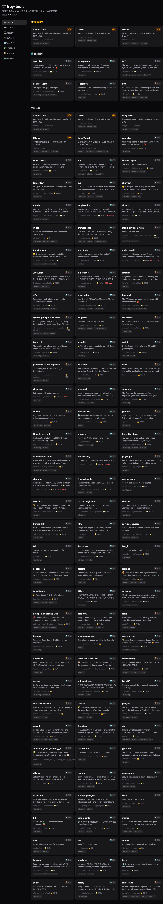

# 🛠️ trey-tools

**每天自动更新的开源工具导航站。** 不是又一个 Awesome List——是有截图、有分类、能筛选的真正导航。

[](https://github.com/treyxu23/trey-tools/actions/workflows/deploy.yml)
[](https://github.com/treyxu23/trey-tools/actions/workflows/discover.yml)
[](LICENSE)
[](https://treyxu23.github.io/trey-tools)



🌐 **[打开导航站 →](https://treyxu23.github.io/trey-tools)**

---

## 这东西干嘛的

GitHub 上每天冒出几百个新工具。你靠什么发现——刷 Trending？翻 Awesome List？等别人推荐？

trey-tools 帮你干了这件事：

- 🤖 **自动盯着** — 每天从 GitHub Trending + 20 个热门 Topic 抓新项目
- 🏷️ **帮你分类** — 不是纯文本堆砌，按形态 + 用途两级分类，标签可筛选
- 🔥 **趋势可见** — 哪些在涨、哪些在爆，一眼看出
- ⭐ **手动精选** — 靠谱的工具人工标注，和自动发现区分开

## 怎么用

直接打开 [treyxu23.github.io/trey-tools](https://treyxu23.github.io/trey-tools)，左边点分类，上面筛标签。

或者你也是工具控——**Star 这个仓库**，每天看一眼 `data/discovered/latest.json`，比刷 Trending 快。

## 📦 技术栈

- **框架**：[Astro](https://astro.build) — 纯静态，GitHub Pages 秒开
- **样式**：Tailwind CSS v4，深色主题
- **数据**：YAML（精选） + JSON（自动发现）
- **发现引擎**：GitHub Actions 定时抓取 Trending 页面 + Search API
- **部署**：免费 GitHub Pages，push 自动上线

## ➕ 加新工具

在 `data/curated/` 下新建一个 `.yaml` 文件：

```yaml
slug: your-tool
name: 工具名
repo: owner/repo
category: cli
tags: [ai-coding, productivity]
description: 一句话说清楚这工具干嘛的
added: 2026-06-30
featured: false
```

Push → 自动上线。

## 📄 License

MIT
